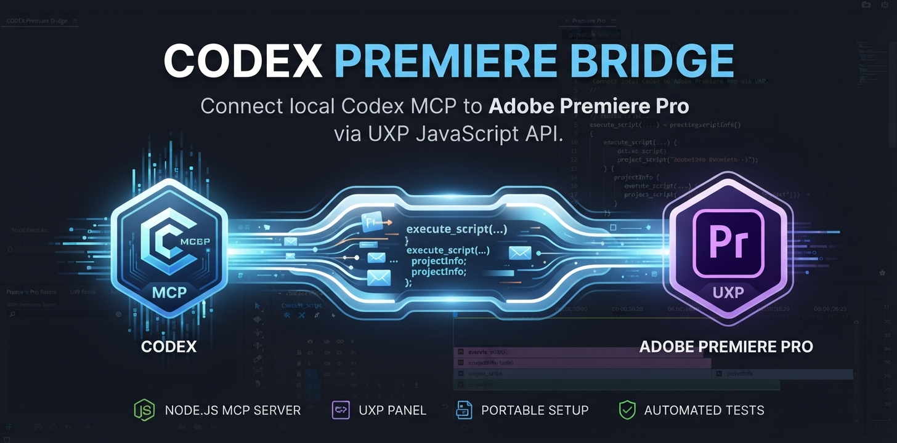

# Codex Premiere Bridge



Connect a local Codex client to Adobe Premiere Pro using a UXP panel and a small Node.js MCP server. Ask Codex to inspect the current project or carry out edits using Premiere's UXP JavaScript API.

This repository packages the existing Codex Premiere Bridge with portable setup, a per-computer connection token, a local `.ccx` installer, diagnostics, and automated tests. It is an independent integration, not an Adobe or OpenAI product. It uses UXP, not the older CEP/ExtendScript bridge.

## Requirements

| Technology | Requirement |
| --- | --- |
| Adobe Premiere Pro | **26.0 or newer**; installed and licensed separately |
| Adobe Creative Cloud Desktop | Required to install the generated `.ccx` |
| Node.js | **22 or newer**, with npm, available in your terminal |
| Codex | Signed in, running locally, with local stdio MCP support |
| UXP Developer Tool | Optional alternative installation/debugging route, version 2.2+ |
| Git | Optional for cloning; GitHub's Download ZIP works too |

There are **no external npm dependencies** and **no Python dependencies**. `requirements.txt` records this explicitly; do not install Python for this project. The bridge does not call the OpenAI API and does not require an API key of its own. Your normal Codex account/access is still required. Premiere, Creative Cloud, and Codex are not bundled.

Windows is the primary setup target. The Node scripts also run on macOS; Adobe installation there has not been verified for this copy. Hosted ChatGPT chats do not read this local configuration.

## Install after cloning or downloading

### 1. Generate this computer's files

Open a terminal in the repository directory:

```powershell
node --version
npm run setup
```

On Windows, if PowerShell blocks `npm.ps1`, use `npm.cmd run setup` instead. No `npm install` step is needed.

Setup creates:

- `local/connection.json`: a fresh private token and port (default `32126`).
- `local/panel/`: the panel with matching connection settings.
- `local/codex-config.toml`: a configuration snippet with absolute paths for this checkout.
- `dist/Codex-Premiere-Bridge-1.1.0.ccx`: this computer's private installer.

Setup preserves the token when rerun. These generated directories are ignored by Git. Keep the repository in a permanent location because Codex starts the server from it.

### 2. Install the Premiere panel

1. Launch Premiere once and enable **Developer Mode** in its **Preferences/Settings > Plugins**.
2. Double-click `dist/Codex-Premiere-Bridge-1.1.0.ccx` and complete installation in Creative Cloud Desktop.
3. In Premiere, open **Window > UXP Plugins > Codex Premiere Bridge**. Keep the panel open while using Codex.

Alternative: install Adobe UXP Developer Tool 2.2+, enable its Developer Mode, add **`local/panel/manifest.json`**, and click Load with Premiere running. Do not load `panel/manifest.json` directly: the source folder intentionally has no private connection configuration.

The plugin ID is preserved from the original bridge (`local.codex.premiere.bridge`), so installing this copy updates/replaces that panel rather than creating a second one. Adobe may request approval for network access and code generation; those permissions are needed for the local bridge.

### 3. Connect Codex

Open `local/codex-config.toml` and merge its `[mcp_servers.premiere]` section into your Codex configuration, normally `%USERPROFILE%\.codex\config.toml` on Windows or `~/.codex/config.toml` on macOS. If you set `CODEX_HOME`, use its configuration instead. **Replace an existing `premiere` section; do not duplicate it or overwrite unrelated configuration.** Restart Codex after saving.

If the Codex CLI is installed, you can instead register the server from PowerShell in this repository:

```powershell
codex mcp add premiere -- node "$((Resolve-Path .\server.cjs).Path)"
codex mcp list
```

Use one configuration route. Do not run `npm start` alongside Codex: Codex starts and owns the server process, and only one process can use the bridge port.

### 4. Verify and use

With Codex running and the Premiere panel open:

```powershell
npm run doctor
```

The output should show `connected: true`. Then ask Codex:

> Use the Premiere bridge to check the connection and list the active project's sequences. Do not change the project.

For editing, first save a copy of your project, then describe the intended change. The bridge gives Codex scripting access; it is not a chat interface embedded in Premiere and does not guarantee every editing operation is supported by Adobe's API.

## Available MCP tools

| Tool | Purpose |
| --- | --- |
| `connection_status` | Check panel contact and whether a command is pending |
| `project_info` | Read the active project and sequences |
| `execute_script` | Run an async JavaScript function body with `premierepro` available |
| `get_result` | Inspect a command result without executing it again |

Scripts must return JSON-serializable data. `execute_script` accepts `timeout_seconds` from 1 to 45 (default 30). A timeout after delivery does **not** cancel an Adobe operation: inspect `get_result` and project state before another edit. Only one command is outstanding at a time. Results are in memory (last 20); restarting the server loses them.

## Publish to GitHub

Push the **source repository**, not the generated installer or local configuration. Every person runs setup after cloning to create their own token. No repository URL is hardcoded, so the project works with any GitHub repository name.

From the project folder, if it is not already a Git repository:

```powershell
git init -b main
git add .
git status
git commit -m "Package Codex Premiere Bridge"
git remote add origin https://github.com/YOUR-ACCOUNT/YOUR-REPOSITORY.git
git push -u origin main
```

Replace the URL with an empty repository you own. Before committing, confirm `local/`, `dist/`, `connection.json`, and `.ccx` files are absent from `git status`. Never force-add them or attach your generated `.ccx` to a public GitHub release: it embeds your token. Share source archives instead. See [distribution notes](docs/DISTRIBUTION.md).

## Development and maintenance

```powershell
npm run check
npm test
npm run setup
```

Edit the files in `panel/` and `server.cjs`, then rerun setup and reinstall the generated CCX (or reload the generated panel in UDT). `npm run package` only repackages the already generated `local/panel/`; use setup to refresh it after source edits.

GitHub Actions runs syntax checks and tests on Windows/Linux with Node 22/24. Tests simulate the panel; Adobe Premiere is not installed in CI. See [architecture](docs/ARCHITECTURE.md), [troubleshooting](docs/TROUBLESHOOTING.md), [security](SECURITY.md), and [validation](docs/VALIDATION.md).

## Official references

- [Codex MCP configuration](https://developers.openai.com/codex/mcp)
- [Adobe: Install a UXP plugin](https://developer.adobe.com/premiere-pro/uxp/plugins/distribution/install/)
- [Adobe: UXP Developer Tool requirements](https://developer.adobe.com/premiere-pro/uxp/introduction/essentials/dev-tools/)
- [Premiere UXP API documentation](https://developer.adobe.com/premiere-pro/uxp/)

## License and provenance

Copied from the user's existing local Codex Premiere Bridge and updated for portable distribution. No license declaration was present in the source. No new open-source license is asserted here; the repository owner should choose and add one if they intend to grant reuse rights. Adobe and OpenAI products retain their own terms and trademarks.
